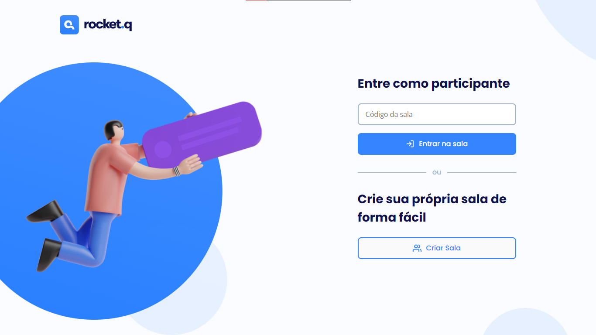

<div align="center">

# 

</div>

<p align="center">
  <a href="#-sobre-o-projeto">Projeto</a>&nbsp;&nbsp;&nbsp;|&nbsp;&nbsp;&nbsp;
  <a href="#-tecnologias-utilizadas">Tecnologias</a>&nbsp;&nbsp;&nbsp;|&nbsp;&nbsp;&nbsp;
  <a href="#-instalação">Instalação</a>&nbsp;&nbsp;&nbsp;|&nbsp;&nbsp;&nbsp;
  <a href="#-license">Licença</a>
</p>

<p align="center">
 

  
</p>



## :white_check_mark: Resultado


## 💻 Sobre o projeto

Este projeto propõe gerenciar salas de perguntas anônimas dos usuários direcionadas ao criador da sala, que tendo posse da senha, poderá ver as perguntas e escolher seus destinos. Desenvolvido com recursos abertos da **NLW Rocketseat**.

## 🚀 Tecnologias utilizadas

Esse projeto foi desenvolvido com as seguintes tecnologias:
- Html5
- Css3
- JavaScript
- NodeJS
- SQLite
- Express
- EJS
 
## 💾 Instalação

Siga os passos a baixo para executar o projeto!

- Clone o repositório

```
git clone https://github.com/freddcf/rocket.q.git
```

- Instale todas as dependências do projeto

```
npm install
```
```
npm install ejs
```

```
npm install  nodemon-D
```

```
npm install sqlite
```

```
npm install sqlite3
```

- Gerando as tabelas do banco de dados

```
npm run init-db
```

Dê start na apliação

```
npm start
```

- Em seguida acesse http://localhost:3000 no seu navegador.

## 📬 Como contribuir

- Faça um fork desse repositório;
- Cria uma branch com a sua feature: `git checkout -b minha-feature`;
- Faça commit das suas alterações: `git commit -m 'feat: Minha nova feature'`;
- Faça push para a sua branch: `git push origin minha-feature`.
- Status do Projeto: Concluido :heavy_check_mark:


Depois que o merge da sua pull request for feito, você pode deletar a sua branch.


## 📝 License

Esse projeto está sob a licença MIT. Veja o arquivo [LICENSE](LICENSE) para mais detalhes.

---
<h4 align="center">
    Feito com 💙 ✨ by <a href="https://github.com/freddcf" target="_blank">Fred Fonseca</a>
</h4>
